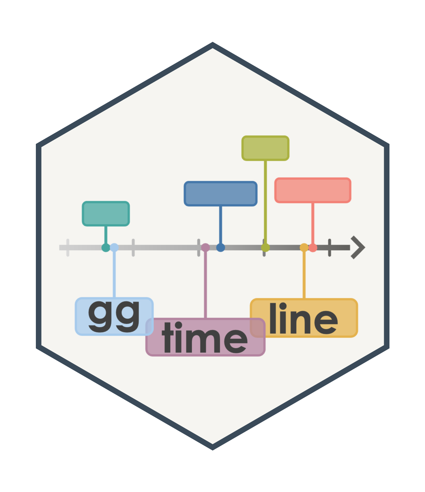
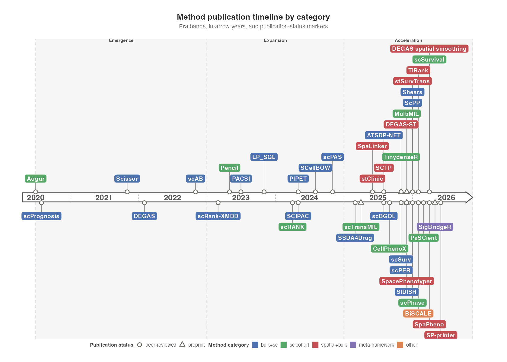
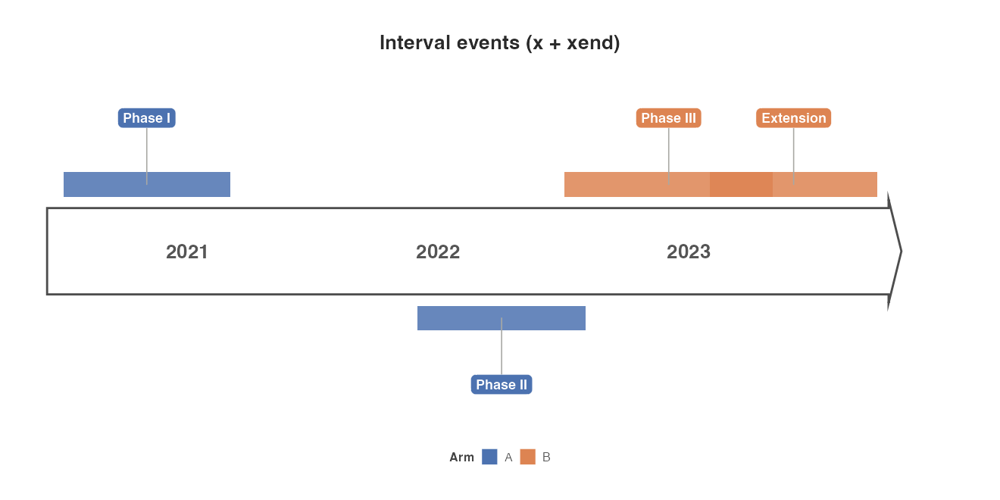
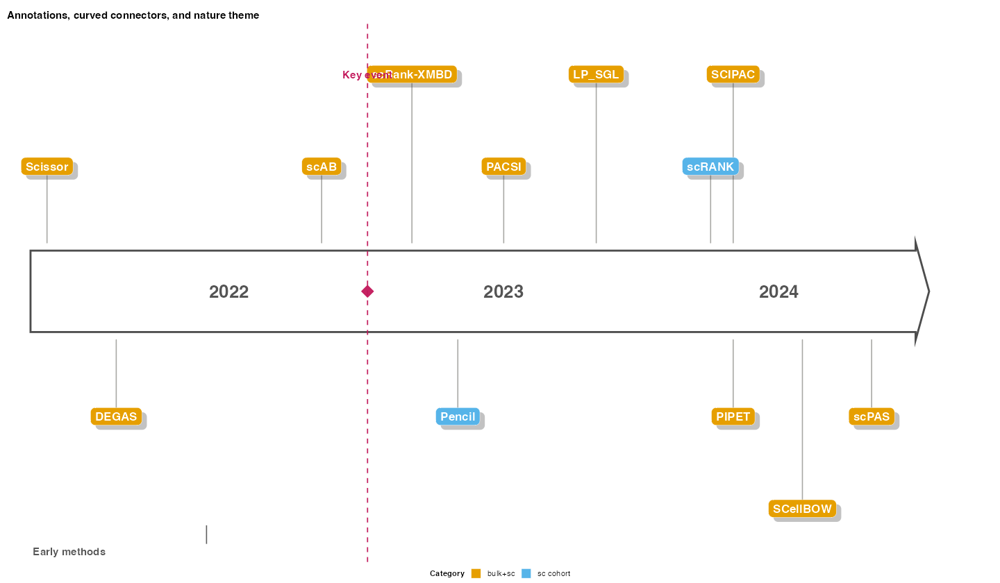
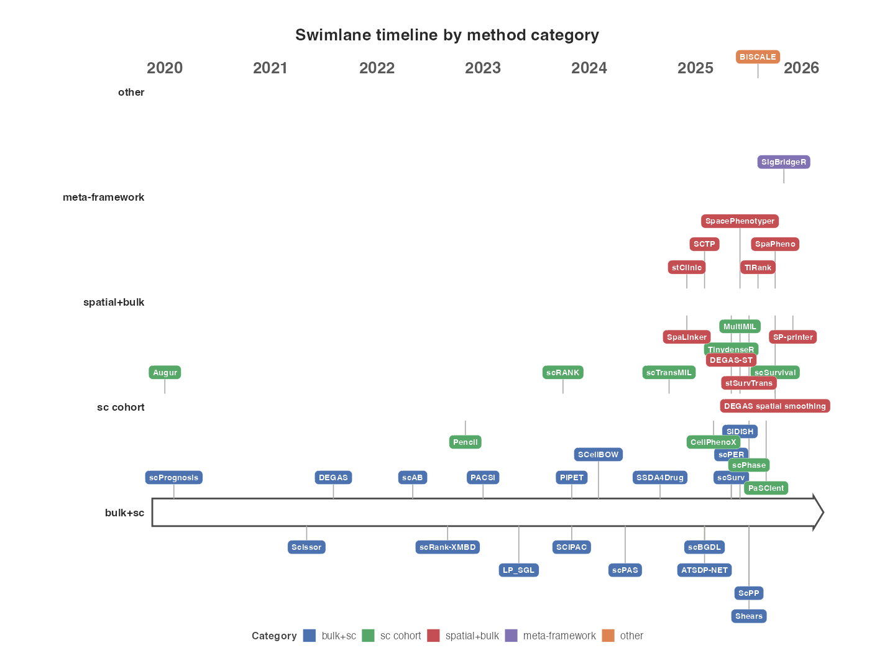
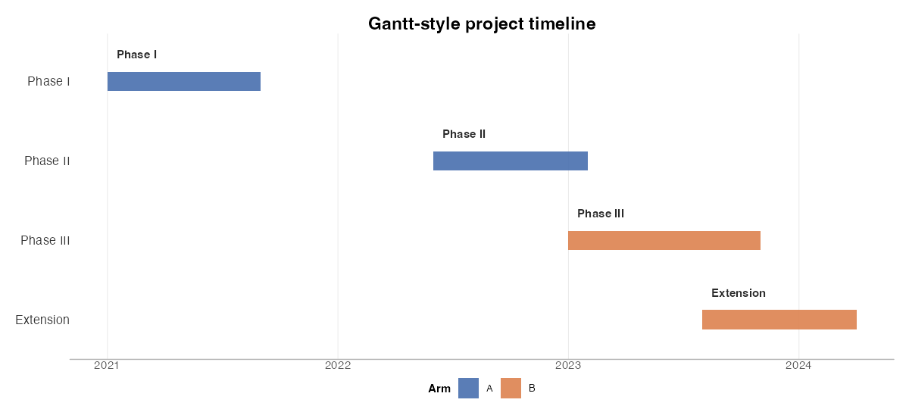
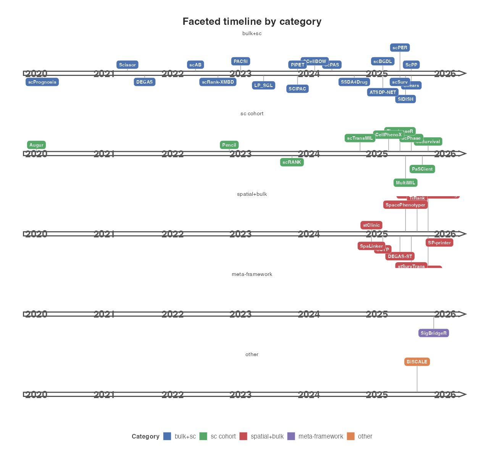

# <a href="https://brooksbenard.github.io/ggtimeline"></a> ggtimeline

Publication-ready timeline charts for [ggplot2](https://ggplot2.tidyverse.org/).

## Installation

```r
# install.packages("remotes")
remotes::install_github("brooksbenard/ggtimeline")
```

## Quick start

The bundled `phenotype_methods_timeline` dataset has 41 methods from the
[phenotype-mapping-methods](https://github.com/brooksbenard/scIMPEL/blob/main/docs/phenotype-mapping-methods.md)
guide (publication dates, categories, and OpenAlex citations).

```r
library(ggplot2)
library(ggtimeline)

data("phenotype_methods_timeline")

eras <- data.frame(
  start = as.Date(c("2020-07-01", "2023-01-01", "2025-01-01")),
  end   = as.Date(c("2022-12-31", "2024-12-31", "2026-12-31")),
  label = c("Emergence", "Expansion", "Acceleration"),
  fill  = c("#4C72B0", "#55A868", "#C44E52")
)

ggtimeline(
  phenotype_methods_timeline,
  aes(x = date, label = topic, fill = category, shape = status),
  year_breaks = "1 year",
  year_side = "inside",
  year_lines = 1,
  eras = eras,
  show_points = TRUE,
  base_height = 1.35,
  height_step = 1.0,
  label_size = 4.2
) +
  scale_timeline_fill(name = "Method category") +
  scale_timeline_shape(name = "Publication status")
```



## Input data

| Column | Role |
|--------|------|
| `date` | Event date (horizontal position) |
| `topic` | Label text (`aes(label = …)`) |
| Aesthetic columns | `colour`, `fill`, `shape`, `size`, … |
| Grouping | Optional `aes(group = …)` for shared styling |

## Useful options

| Argument | Purpose |
|----------|---------|
| `eras` | Background era bands (`start`/`end`, optional `label`/`fill`/`alpha`) |
| `year_breaks` | In-arrow year labels (`"1 year"`, `"auto"`, or explicit years) |
| `year_lines` | In-arrow dashed year-boundary ticks (`TRUE`, `1`, `"2 years"`, …) |
| `show_points` | Publication-status (or other) markers on the arrow edges |
| `axis_width` / `axis_tip` | Arrow thickness and tip depth |
| `connector_colour` / `connector_size` | Stem colour and width |
| `side`, `base_height`, `height_step` | Label placement and stacking |

Year tick styling: `year_line_colour`, `year_line_width`, `year_line_alpha`.

Plots are standard `ggplot` objects—add `labs()`, scales, and themes as usual.

## Interval / range events

Map `xend` (or `xmax`) to draw horizontal span bars for intervals. Labels and
connectors anchor at the midpoint; zero-length intervals stay point-like.

```r
trials <- data.frame(
  start = as.Date(c("2021-01-01", "2022-06-01", "2023-01-01")),
  end   = as.Date(c("2021-09-01", "2022-06-01", "2024-03-01")),
  topic = c("Phase I", "IND filing", "Phase II"),
  arm   = c("A", "A", "B")
)

ggtimeline(
  trials,
  aes(x = start, xend = end, label = topic, fill = arm),
  year_breaks = "1 year",
  span_height = 0.12,
  span_alpha = 0.85
) +
  scale_timeline_fill()
```



## Annotations, themes, and label styling

```r
ggtimeline(
  phenotype_methods_timeline,
  aes(x = date, label = topic, fill = category),
  label_wrap = 18,
  label_box = "shadow",
  connector_type = "curved",
  axis_tip_style = "circle",
  axis_gradient = TRUE
) +
  add_milestone(as.Date("2023-01-01"), label = "Key event") +
  add_span(as.Date("2021-01-01"), as.Date("2022-01-01"), label = "Range") +
  scale_timeline_fill(palette = "okabe") +
  theme_timeline("nature")
```



- `label_wrap` wraps long topic labels at a fixed character width.
- `cluster_radius` snaps nearby event labels to a shared x position while
  connector stems still originate from each event's own date.
- `connector_type` is `"straight"`, `"elbow"`, `"curved"`, or `"none"`.
- `label_box` accepts `TRUE`/`FALSE`/`"shadow"`, plus `label_box_fill`,
  `label_box_colour`, `label_box_alpha`, `label_box_radius`.
- `axis_tip_style` is `"arrow"`, `"flat"`, `"none"`, or `"circle"`;
  `axis_gradient = TRUE` fills the bar axis with a left-to-right gradient.
- `era_label_position`, `era_border`, `era_label_angle` style era bands.
- `scale_timeline_fill()` / `scale_timeline_colour()` accept named presets:
  `"default"`, `"okabe"`, `"nature"`, `"nejm"`, or a custom colour vector.
- `theme_timeline()` provides `"minimal"`, `"nature"`, and `"dark"` presets.

## Swimlanes

```r
ggtimeline_swimlane(
  phenotype_methods_timeline,
  aes(x = date, label = topic, group = category, fill = category)
) +
  scale_timeline_fill()
```



## Gantt chart

```r
ggtimeline_gantt(
  trials,
  aes(x = start, xend = end, label = topic, fill = arm)
) +
  scale_timeline_fill()
```



## Faceted timeline

```r
ggtimeline(
  phenotype_methods_timeline,
  aes(x = date, label = topic, fill = category)
) +
  facet_timeline(~category) +
  scale_timeline_fill()
```



## Importing publication data

Soft-depends on **httr2** (or **httr**) and **jsonlite**; install with
`install.packages(c("httr2", "jsonlite"))`.

```r
from_openalex(c("10.1038/s41586-020-2649-2", "W2741809807"))
from_pubmed(c("32015508", "31978945"))
```

Helpers for tidy input:

```r
ggtimeline_data(df, date = "date", label = "topic")
ggtimeline_data(df, start = "start", end = "end", label = "topic")
scale_timeline_size()
```

## License

MIT © Brooks Benard
