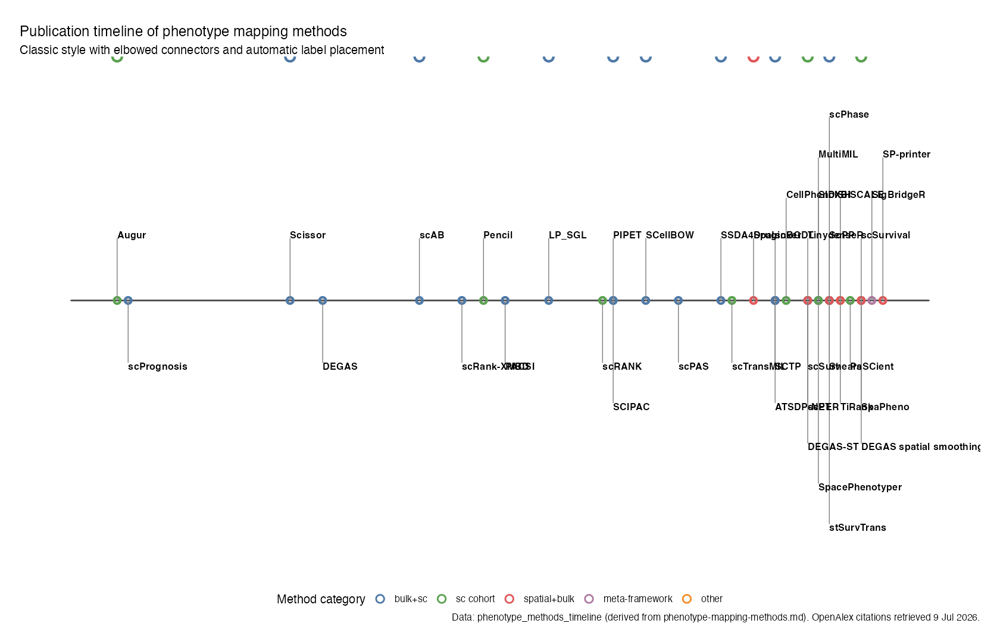
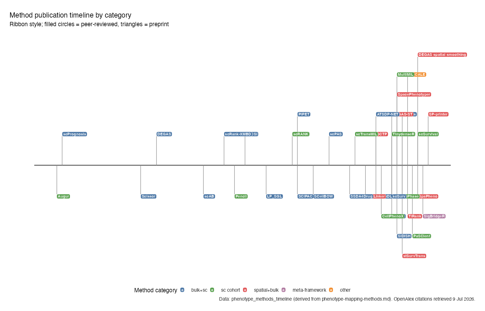
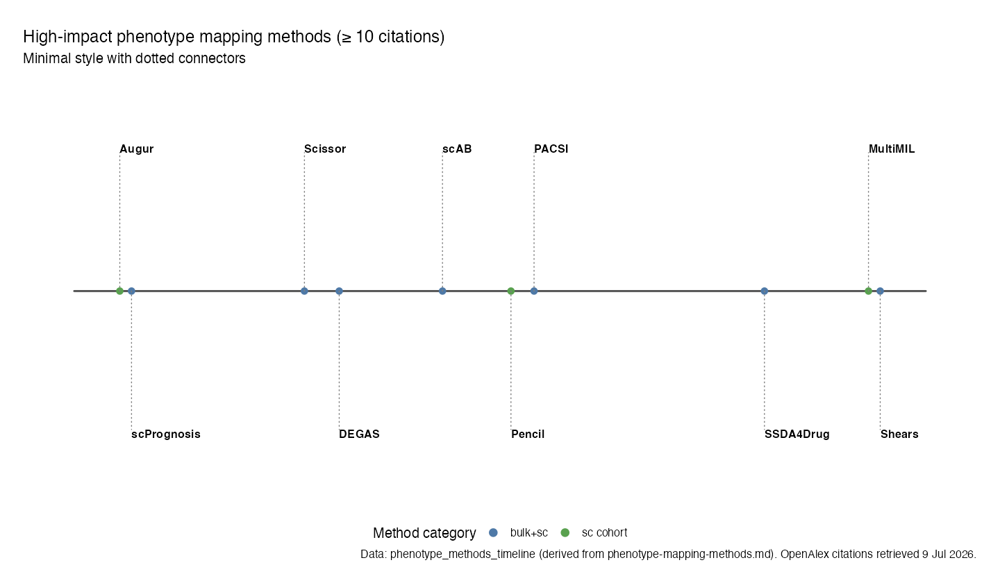

# ggtimeline

Flexible timeline visualisations for [ggplot2](https://ggplot2.tidyverse.org/). Create publication-ready timelines with multiple visual styles, elbowed connectors, automatic above/below label placement, and staggered heights to reduce overlap.

## Installation

```r
# install.packages("remotes")
remotes::install_github("brooksbenard/ggtimeline")
```

## Demo: phenotype mapping methods timeline

The bundled `phenotype_methods_timeline` dataset contains 40 computational methods from the [phenotype-mapping-methods](https://github.com/brooksbenard/scIMPEL/blob/main/docs/phenotype-mapping-methods.md) reference guide, with publication dates, method categories, and citation counts.

Run the interactive demo:

```r
library(ggtimeline)
demo(phenotype_methods_timeline)
```

Or run the full example script:

```r
source(system.file("examples", "phenotype-methods-timeline-demo.R", package = "ggtimeline"))
```

### Classic style

Methods coloured by data modality (`bulk+sc`, `sc cohort`, `spatial+bulk`, etc.):

```r
library(ggplot2)
library(ggtimeline)

data("phenotype_methods_timeline")

ggtimeline(
  phenotype_methods_timeline,
  aes(x = date, label = topic, colour = category, fill = category),
  style = "classic",
  side = "auto",
  date_breaks = "2 years",
  date_labels = "%Y"
) +
  scale_timeline_colour() +
  scale_timeline_fill() +
  labs(
    title = "Phenotype-to-cell mapping methods (2020\u20132026)",
    caption = "Data from phenotype-mapping-methods.md"
  )
```



### Ribbon style

Alternate above/below labels with publication status encoded by shape:

```r
ggtimeline(
  phenotype_methods_timeline,
  aes(x = date, label = topic, fill = category, shape = status),
  style = "ribbon",
  side = "alternate"
) +
  scale_timeline_fill() +
  scale_timeline_shape()
```



### Minimal style (high-impact methods)

Subset to methods with ≥ 10 OpenAlex citations:

```r
high_impact <- subset(phenotype_methods_timeline, citations >= 10)

ggtimeline(
  high_impact,
  aes(x = date, label = topic, colour = category),
  style = "minimal"
) +
  scale_timeline_colour()
```



## Input data

Provide a data frame with:

| Column | Role |
|--------|------|
| `date` | Event date (controls horizontal spacing) |
| `topic` | Label text (mapped via `aes(label = topic)`) |
| Aesthetic columns | `colour`, `fill`, `shape`, `size`, etc. |
| Grouping column | Shared aesthetics via `aes(group = category)` |

## Timeline styles

| Style | Description |
|-------|-------------|
| `"classic"` | Axis markers with ring endpoints and elbowed connectors |
| `"ribbon"` | Thick timeline bar with coloured label boxes |
| `"milestone"` | Boxed labels with endpoint markers |
| `"minimal"` | Compact dotted connectors |

## Customisation

All plots return standard `ggplot` objects. Add layers, scales, and themes as usual:

```r
ggtimeline(
  phenotype_methods_timeline,
  aes(x = date, label = topic, colour = category),
  style = "minimal",
  side = "auto",
  elbowed = TRUE,
  base_height = 1,
  height_step = 0.6
) +
  scale_timeline_colour() +
  labs(title = "Phenotype mapping methods (2020\u20132026)")
```

### Lower-level geoms

For full control, compose individual layers:

```r
ggplot(phenotype_methods_timeline, aes(x = date, label = topic, colour = category)) +
  stat_timeline(side = "auto") +
  geom_timeline_connector(stat = "timeline", elbowed = TRUE) +
  geom_timeline_point(stat = "timeline") +
  geom_timeline_label(stat = "timeline")
```

## Label placement

- **`side = "auto"`** — picks above or below to minimise overlap (default)
- **`side = "alternate"`** — alternates above/below
- **`side = "above"` / `"below"`** — force one side
- **`height_step`** — increases vertical stagger when labels collide on the same side
- **`elbowed = TRUE`** — horizontal-then-vertical connector elbows

## License

MIT © Brooks Benard
